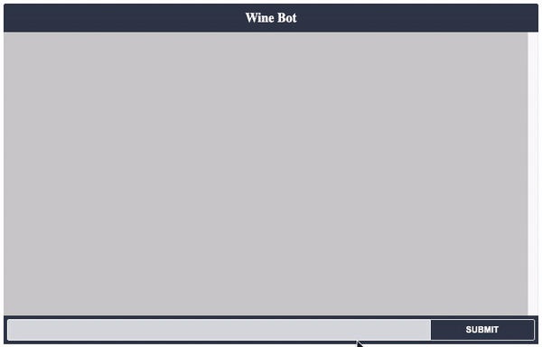

# VP_chatbot


# Table of Contents
This is a wine recommendation chatbot for specific business use that translate taxonomy data into an interactive dialog.
1.  [Overview of the Project](README.md#overview-of-the-project)
2. [Repo Structure](README.md#repo-structure)
3. [Setup](README.md#setup)
4. [Requirements](README.md#requirements)
5. [Run A Train and Test](README.md#run-a-train-and-test)


To check-out the repo:

```
git clone https://github.com/ZhengWang01/VP_chatbot.git
```


## Overview of the Project


The deliverable of the project is a Web App that allows user to tell the chatbot what they need, and get the recommendation on which wine they should buy.

<p float="left">
  
</p>

## Repo Structure

Below is the structure of this repo.

    ├── README.md
    ├── data
    │   └── nlu.md
    │   └── stories.md
    │   └── wine_data.pkl
    ├── models
    │   └── doc2vec_model
    │   └── doc2vec_embeddings.pkl
    │   └── lsa_embeddings.pkl
    │   └── svd_model.pkl
    │   └── tfidf_model.pkl
    ├── src
    │   └── __init__.py
    │   └── information_retrieval_model.py
    ├── tests
    │   └── conversation_tests.md
    ├── .gitignore
    ├── LICENSE
    ├── README.md
    ├── WineBotDemo.gif
    ├── __init__.py
    ├── actions.py
    ├── config.yml
    ├── credentials.yml
    ├── domain.yml
    ├── endpoints.yml
    ├── index.html
    ├── requirements.txt
    └── train_model.ipynb

## Setup

clone the project:
```
git clone https://github.com/ZhengWang01/VP_chatbot.git
```
Get into the main folder:
```
cd WineBot
```

Creating a virtual environment for the project
On macOS and Linux:

```
python3 -m venv env
```
On Windows:
```
py -m venv env
```
Activating a virtual environment
On macOS and Linux:
```
source env/bin/activate
```
On Windows:

```
.\env\Scripts\activate
```
## Requirements

```
pip3 install -r requirements.txt
```


## Run A Train and Test

Choice #1. To run the Rasa Chatbot in terminal, run:

```
rasa run actions & rasa shell
```

Choice #2. To run the Rasa Chatbot in browser, run:
```
rasa run -m models --enable-api --cors "*" --debug
```
In another terminal in the save directory and virtual environment, run:
```
rasa run actions
```
double-click on the index.html

